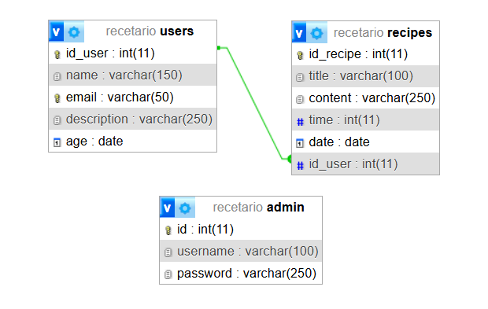

# Blog-de-recetas
TPE Web 2 - Blog de recetas

## Alumnos
Ribas, Maria Clara (44339478) y Saganea, Giuliana Celeste (44534456)

## Temática
Recetario online

## Breve introducción
Nuestro sitio web consiste en un recetario destinado a la publicación de recetas culinarias donde los usuarios pueden subir sus propias recetas con instrucciones e imágenes. La base de datos posee relación 1 a N: Cada usuario puede publicar varias recetas y cada receta pertenece a un único usuario, quien es su autor registrado.

## Diagrama Entidad-Relación (DER)

